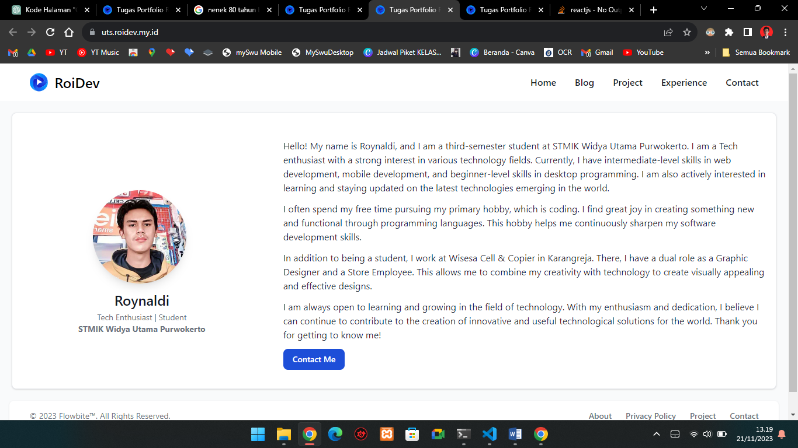
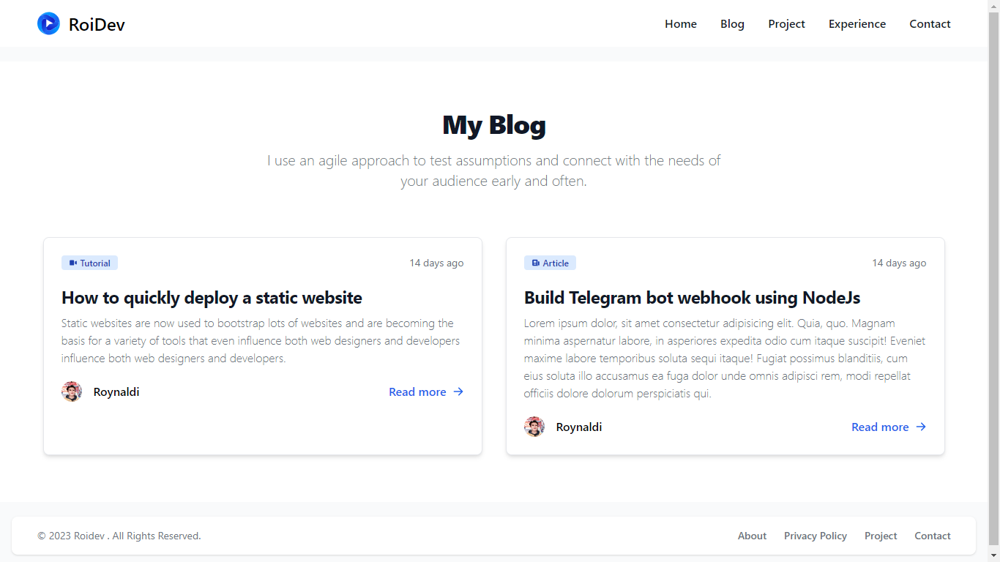
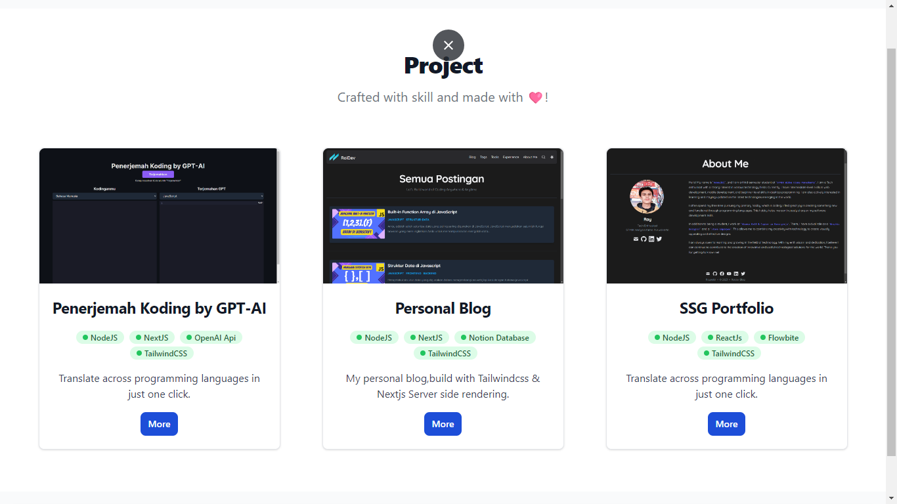
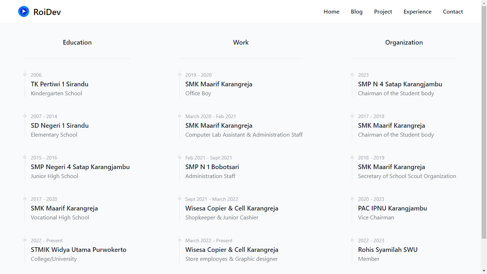
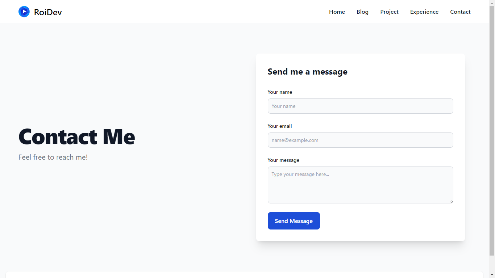

# Project for UTS Web Programming C3.3
> Nama : Roynaldi
> Nim  : SSI202203088
> Kelas: C3.3 Sistem Informasi

## URL Deploy

[https://uts.roidev.my.id](https://uts.roidev.my.id)

## Prerequesites to install

- NodeJs >=18

## Installation

clone my repository

``` bash
    git clone https://github.com/roynaldi3301/uts-webpro
```
run installation
  ```bash
  npm run dev
  ```
run vite server in dev mode
```
npm run dev
```
linting
```
npm run lint
```
build vite
```
npm run build
```

## Build & deploy with 🩷 using :
- Tailwindcss
- Flowbite
- React
- Vite
- Typescript
- Vercel

## Screenshoot
- About

- Blog

- Project

- Experience

- Contact Me


>Lets build world of coding,Anywhere & Anytime🗿
_- Roidev(2001)_